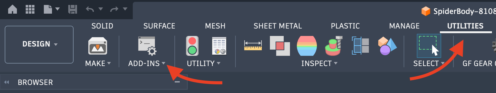
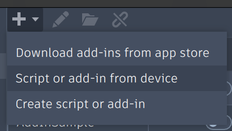
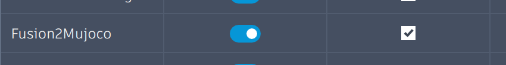
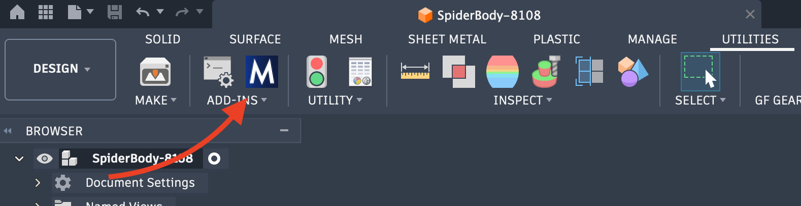
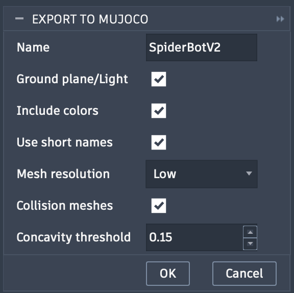

# Fusion2Mujoco

A Fusion 360 add-in that exports your assembly to a [MuJoCo](https://mujoco.org/) MJCF XML model file, complete with joints, appearance colors, and optional collision geometry.

## Installation

Fusion2Mujoco is not yet available in the Fusion 360 Add-In store, so it must be installed manually.

1. **Download the add-in.** Clone this repository or download and extract the zip.

2. **Open Fusion 360** and go to **Utilities → Add-Ins** (or press `Shift+S`).
    

3. Click the **+** button and **Script or add-in from device**.
    

4. Browse to `Fusion2Mujoco` repo folder and click **Open**.

5. The add-in will appear in the list. Toggle the "Run on Startup" checkbox, and the "Run" switch.
    

6. Optionally check **Run on Startup** so the add-in loads automatically every time Fusion 360 opens.

Once loaded, an **Export to Mujoco** button appears in the **Utilities** panel of the Design workspace toolbar.

## Usage

1. Open the Fusion 360 assembly you want to export. The model should use standard joints (not as-built joints) to define the kinematic structure.

2. Goto the **Utilities** tab and click the **Export to Mujoco** button in the toolbar
    

3. Configure the export options in the dialog (see [Export Options](#export-options) below), then click **OK**.

4. Choose where you want th export files to be saved

5. A progress dialog tracks the export. You can cancel at any time. The Text Commands panel will display detailed log output.

6. When the export completes, the output is written to `<destination>/<model name>/`

## Export Options

| Option                   | Description                                                                                                                                                                                                                                                                                                                                                    |
| ------------------------ | -------------------------------------------------------------------------------------------------------------------------------------------------------------------------------------------------------------------------------------------------------------------------------------------------------------------------------------------------------------- |
| **Name**                 | The name used for the output folder and the `model` attribute of the MJCF file. Cannot be blank or contain characters that are invalid in file names. The name is remembered per model.                                                                                                                                                                        |
| **Ground plane / Light** | Adds a checkerboard ground plane and a directional light to the scene. The model root is automatically lifted so its lowest point sits exactly on the ground. Disable this when the model will be `<include>`d into a larger simulation environment.                                                                                                           |
| **Include colors**       | Reads the appearance (color, roughness, metalness) assigned to each component in Fusion 360 and writes `<material>` assets into the MJCF. Textures and image-based patterns are not exported.                                                                                                                                                                  |
| **Use short names**      | Shortens body and mesh names by dropping path segments that are identical across all instances, keeping only the segments needed to uniquely identify each body. Useful for deeply nested assemblies where the full path is unwieldy.                                                                                                                          |
| **Collision meshes**     | Runs [CoACD](https://github.com/SarahWeiii/CoACD) on each visual mesh to produce a set of convex collision hulls. Enables accurate contact simulation but significantly increases export time (potentially several minutes per component). When enabled, visual geoms are placed in a non-colliding group and separate collision geoms are added to each body. |
| **Concavity threshold**  | Controls how aggressively CoACD decomposes each mesh. Lower values produce more hulls that better approximate the original shape; higher values produce fewer, coarser hulls. Valid range is 0.01 – 1.0. Only active when **Collision meshes** is enabled.                                                                                                     |

## Limitations

### As-built joints are not exported

Fusion 360 has two kinds of joints: _joints_ (defined during modeling) and _as-built joints_ (placed after the fact on an already-assembled design). Only standard joints are read by the exporter. If your kinematic structure relies on as-built joints, convert them to standard joints before exporting.

### Each component can only be the child link of one joint

The MJCF format represents the kinematic structure as a tree, where each body has exactly one parent. If the same Fusion component appears as the child (Component 1) in more than one joint, it will be placed under multiple parents in the exported XML, producing a malformed hierarchy. Structure your assembly so that each moving component is the child of exactly one joint.

### Limited joint types

Only three Fusion joint motion types are translated to MuJoCo:

- **Rigid** — no joint element is emitted; the bodies are welded together.
- **Revolute** — exported as a MuJoCo `hinge` joint.
- **Slider** — exported as a MuJoCo `slide` joint.

All other Fusion joint types (cylindrical, ball, pin-slot, planar, etc.) are treated as rigid and will not produce any MuJoCo joint element. Joints of unsupported types will not move in simulation.

Joint limits are exported only when both the minimum and maximum limits are explicitly enabled in the Fusion joint dialog. If either limit is disabled, no `range` attribute is written and the joint is treated as unlimited.

### Appearance is applied at the component level

Color, roughness, and metalness are read from the appearance assigned to the component occurrence (or, as a fallback, the first visible body or the component material). If individual bodies within a component have different appearances, only one appearance is used for the entire component in the MJCF output.

Textures and image-based patterns are not supported — only solid colors and PBR scalar values (roughness, metalness) are exported.
